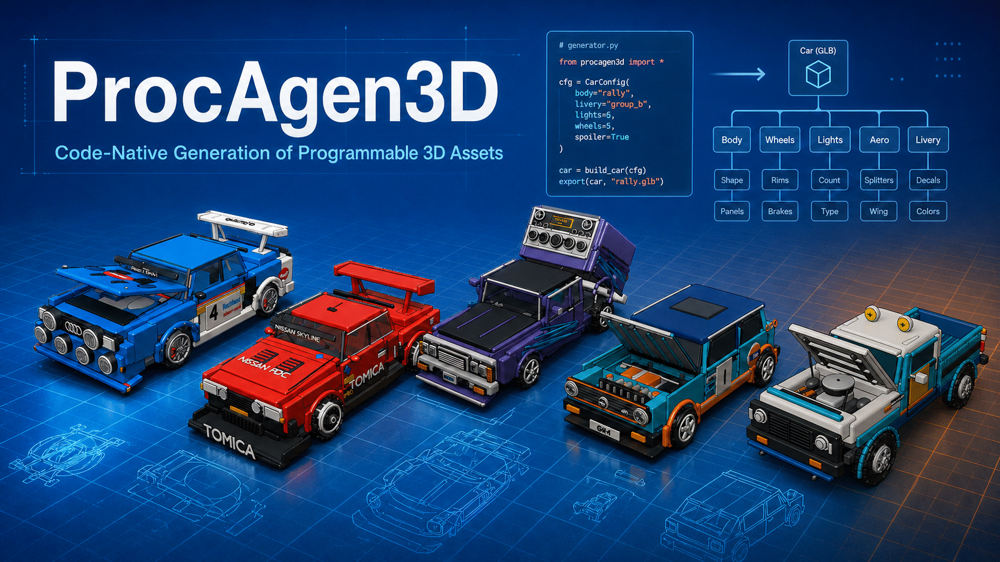

# ProcAgen3D

ProcAgen3D turns an **image plus an offline-generated reference GLB** into two
linked deliverables:

- editable Blender Python in `src/program.py`; and
- `artifacts/model.glb`, compiled by running that program in headless Blender.

The reconstruction mode makes the source-of-truth claim explicit:

- `procedural` (default): `program.py` is standalone replay source; the GLB is
  measurement/visual evidence only.
- `glb-ref`: the provenance-locked GLB is normalized and host-loaded
  into `PROCAGEN3D_REFERENCE`. The program creates new derived objects, and the
  originals are removed before save/export. Replay truth is the program plus
  the recorded GLB and preload contract—not the Python file alone.

Generated programs cannot read/import files themselves in either mode.

Version: **0.1.1 (ongoing)**. The previous baseline is **0.1.0**.



## Changelog

### 0.1.1 (ongoing)

This update implements the six reconstruction-quality fixes identified by the
procedural-output audit, in the recommended order:

1. **GLB-safe color and materials.** Generation and repair prompts now require
   direct glTF-safe Principled constants or explicitly baked embedded textures.
   The GLB probe reports base-color factors/textures, primitive usage, vertex
   colors, declared palettes, and implicit-white risk. Spatial RGB, foreground
   palette, and default-white primitive fractions are non-compensating gates.
2. **Structural coherence gates.** Fresh Blender probes measure per-object and
   global components, boundary/non-manifold edges, winding and outward-normal
   proxies, degenerate/poor triangles, self-intersections, inter-object
   intersections, near contacts, and isolated objects. Declared attachment
   failures and unexpected intersections can no longer be hidden by a good
   silhouette score.
3. **Normal-aware visible-surface evidence.** Reference and candidate probes
   now emit canonical depth, world-normal, and object-ID renders. Surface
   comparison adds oriented/unoriented normal error, point-to-plane and
   normal-aware distances, visible/external coverage, surface-area ratios,
   per-object identities, worst-sample identities, and six-view residual
   heatmaps under `artifacts/surface_residuals/`.
4. **Executable attachment plans.** Every normalized plan part has a stable ID,
   exact Blender object names, numeric bounds, and a typed parent attachment
   with contact region, maximum gap/penetration, and minimum contact area.
   Duplicate IDs, missing/self parents, cycles, reversed bounds, and malformed
   tolerances are rejected. Older free-text plans receive deterministic
   compatibility normalization.
5. **Adaptive repair and recovery.** Initial agent failures receive a fresh
   bounded retry. Valid source left by a timeout/non-success can be safely
   salvaged after the normal schema and AST guards. Fidelity repair stops on
   pass, first stall, or budget exhaustion; every valid candidate is ranked and
   the deterministic best source plus complete artifact set is restored.
6. **Independent quality profiles.** Surface fidelity, detail richness,
   material fidelity, and structural coherence are selectable separately and
   recorded in the workspace, plan, artifact manifest, comparison, and run
   report. Granularity remains a convenient preset. For highly complex cars,
   mecha, characters, or dense scenes where strict fidelity matters more than
   an independently authored procedural claim, use `--mode glb-ref` as the
   reference-cage/derived-geometry path.

### 0.1.0

Initial baseline: provenance-locked image/GLB workspaces, procedural and
`glb-ref` modes, agent-authored `plan.json` plus `program.py`, clean Blender
build/export, canonical render scoring, and bounded repair trajectories.

## Install with uv

Python 3.11+ and Blender 4.5/5.x are required. The coding-agent CLI you intend
to use must already be authenticated.

```sh
uv sync --group dev
uv run procagen3d doctor
```

The repository includes `uv.lock` for reproducible environments. The runtime
uses Rich for terminal progress; the dev group additionally installs pytest.

## Generate an asset

This source checkout includes eight image/GLB pairs under `assets/3d_glb`.

```sh
uv run procagen3d make \
  assets/3d_glb/mystic_mouse_wanderer/reference_01.png \
  assets/3d_glb/mystic_mouse_wanderer/object_0.glb \
  --backend codex \
  --prompt "Build the complete character with named, editable parts"
```

Use `--backend grok` or `--backend cursor` to switch coding agents. Workspaces
are written to `outputs/<name>-<mode>` by default. Use `--name` or `--output` to
change that location; `--name` still receives the `-<mode>` suffix unless it
already ends with the selected mode.

For an explicitly glb-ref reconstruction:

```sh
uv run procagen3d make IMAGE GLB --mode glb-ref
```

Geometry granularity is independent of reconstruction provenance and now acts
as a preset for four independent quality axes:

```sh
uv run procagen3d make IMAGE GLB --granularity fine
uv run procagen3d make IMAGE GLB --mode glb-ref --granularity surface
```

| Granularity preset | Surface fidelity | Detail richness | Material fidelity | Structural coherence |
| --- | --- | --- | --- | --- |
| `coarse` | `off` | `basic` | `basic` | `basic` |
| `medium` (default) | `off` | `standard` | `faithful` | `coherent` |
| `fine` | `balanced` (20k samples/direction) | `rich` | `faithful` | `coherent` |
| `surface` | `strict` (80k samples/direction) | `maximum` | `strict` | `strict` |

Override any axis without changing the others:

```sh
uv run procagen3d make IMAGE GLB \
  --granularity fine \
  --surface-fidelity strict \
  --detail-richness maximum \
  --material-fidelity strict \
  --structural-coherence strict
```

The choices are `off|balanced|strict` for surface,
`basic|standard|rich|maximum` for detail, `basic|faithful|strict` for material,
and `basic|coherent|strict` for structure. The resolved four-axis object is
recorded as `quality_profile`; a resumed workspace inherits it unless an axis
is explicitly overridden.

Fine levels do not equate detail with subdivision count. They tell the authoring
agent to replace primitive-only fitting with custom procedural surfaces, then
run a host-owned bidirectional BVH comparison after export. Candidate-to-reference
distance detects excess/inflated geometry; reference-to-candidate distance detects
missing form. Normal-aware and point-to-plane statistics catch wrong-facing or
incoherent surfaces, visible-coverage gates focus canonical exterior evidence,
and area-ratio gates catch missing or inflated shells. Per-object residuals,
worst identities, and six-view heatmaps drive the repair loop. In `procedural`
mode this is necessarily a best-effort authored
approximation from images and measurements; use `glb-ref` when reference-derived
geometry is acceptable. Increase `--max-fidelity-repairs` for difficult fine or
surface assets.

To upgrade an existing medium workspace such as a local mecha run, resume it
with an explicit profile; the plan/profile mismatch intentionally triggers an
authoring repair before the fine candidate is accepted:

```sh
uv run procagen3d run outputs/strike-style-mecha \
  --granularity fine \
  --max-fidelity-repairs 3
```

To build evidence without spending an agent invocation:

```sh
uv run procagen3d make IMAGE GLB --prepare-only --name my-asset
```

After adding `outputs/my-asset-procedural/src/plan.json` and `program.py`, compile the
current source in a clean build without invoking an LLM:

```sh
uv run procagen3d build outputs/my-asset-procedural
```

Resume an incomplete run or let the configured agent repair it:

```sh
uv run procagen3d run outputs/my-asset-procedural \
  --max-repairs 2 \
  --max-fidelity-repairs 1
```

These are independent budgets: schema/source-guard/Blender failures use
`--max-repairs`; only successful rendered candidates use
`--max-fidelity-repairs`. Fidelity repair is adaptive: the pipeline stops when
a candidate passes, when the first valid repair fails to improve the retained
best candidate, or when the budget is exhausted. The default initial-authoring
retry is one and can be set with `--max-initial-agent-retries`; safely complete
source left by an agent timeout is validated and salvaged before retrying.

Long operations now report their intermediate stages: reference inspection,
canonical rendering, each agent author/repair pass, the clean Blender build,
GLB re-import, and fidelity scoring. Interactive terminals use a Rich spinner;
redirected or CI logs receive explicit start and completion lines. Progress is
written to stderr. During a Codex pass, interactive activity updates the current
spinner in place. Redirected logs show only turn start, completed `src/` writes,
failures, and terminal usage; agent heartbeats are disabled. Successful
workspace checks, reasoning steps, and assistant/tool chatter are suppressed
from live output. Raw reasoning, commands, command output, and provider JSON
remain complete in the workspace logs.
Add `--no-progress` to `make`, `run`, or `build` for a quiet invocation.

## Agent defaults

| Backend | Executable | Default model/mode |
| --- | --- | --- |
| Codex | `codex` | `gpt-5.6-sol`, reasoning effort `xhigh` |
| Grok Build | `grok` | `grok-4.6`, reasoning effort `xhigh` |
| Cursor | `cursor-agent` | `cursor-grok-4.6-xhigh-fast` |

The installed Grok Build 1.0.5 CLI does not expose a separate Fast selector.
ProcAgen3D therefore uses the closest truthful configuration—Grok 4.6 at
Extra High—and `doctor` reports the limitation. Cursor exposes an exact Extra
High Fast model ID.

Each backend is a shell-free subprocess adapter. It records the prompt, JSONL
transcript, stderr, terminal result, usage, model, and modified-file list in
`trajectories/iter_XX`. After a candidate passes GLB validation and clean
re-import, its executed result is also retained as
`trajectories/iter_XX/model.glb`; later repairs cannot overwrite an earlier
iteration's GLB. Agents may change only `src/`.

## Pipeline

```text
image + offline GLB
        │
        ├─ copy + SHA-256 provenance
        ├─ pure-Python GLB container/accessor probe
        └─ isolated Blender reference probe
             ├─ canonical normalization (Z-up, grounded, longest side = 2)
             ├─ evaluated bounds and recomputed mesh geometry
             ├─ topology/contact diagnostics and XYZ cross-sections
             └─ canonical beauty, silhouette/RGB, depth, normal, and object-ID evidence
                         │
                         ▼
               Codex / Grok / Cursor CLI
                         │
                 plan.json + program.py
                         │
             AST source contract and clean build
                         │
        Blender calls build() → editable .blend → exported GLB
                         │
             re-import exact GLB + same-camera renders
                         │
        color/material + detail + structural diagnostics
        optional normal-aware bidirectional surface distance + heatmaps
                         │
        non-compensating gates → adaptive repair → best-candidate rollback
```

The sample GLBs are deliberately handled as semantically weak evidence: most
contain one anonymous merged mesh, one material, no normals, no rig, and no
animation. Node names are not trusted as part labels. Blender computes the
evaluated geometry, while the coding agent infers meaningful construction from
the original image, canonical views, bounds, connected components, and sparse
cross-sections.

For character and hybrid subjects, the validated plan adds an anatomy-aware track:
posture, head-to-body and limb proportions, facial landmarks, hair/headwear,
clothing layers, attachments, held props, and character-relative left/right.
This release verifies the evaluated rest-pose GLB. A generated program may build
an armature, but the pipeline does not yet certify skin weights, animation clips,
IK, or walk cycles; those remain explicit limitations rather than implied output.

For every subject kind, `parts` is an executable structural contract. A part
declares `id`, `object_names`, numeric `approximate_bounds`, and an `attachment`
with `parent_id`, one of `root|fused|surface-contact|embedded|articulated|intentional-gap`,
numeric contact bounds, `max_gap`, `max_penetration`, and `min_contact_area`.
Structural scoring resolves those names against the re-imported GLB and reports
missing semantic objects, unjoined parts, and intersections not authorized by a
`fused` or `embedded` relationship.

The generated `program.py` must define a synchronous, zero-argument `build()`.
It may use `bpy`, `bmesh`, `mathutils`, `math`, and `random`, but it may not read
files, import the source GLB itself, use the network, spawn processes, load
Blender libraries, render, save, or export. In `glb-ref` mode only,
it may inspect and derive new Blender objects from the host-owned normalized
collection. The application performs all external side effects in a clean
temporary build and records the actual mode in both workspace and artifact
provenance.

Generated parent/transform helpers must use explicit world transforms such as
`Matrix.LocRotScale`, or refresh the Blender view layer before reading
`matrix_world`. The source guard rejects the stale snapshot → reparent → restore
pattern that otherwise collapses newly linked custom meshes to the origin.

### Trust boundary

The AST guard, disposable agent workspace, clean build directory, and stripped
Blender environment prevent common accidental violations; they are not a
security sandbox for deliberately hostile Python. A generated Blender program
has the authority of the local Blender process. Use authenticated coding-agent
CLIs that you trust. For untrusted generation, run `make --prepare-only`, review
`src/program.py`, and execute Blender inside your own container/OS sandbox.

## Workspace

```text
outputs/<name>-<mode>/
├── manifest.json
├── inputs/
│   ├── reference.<image-extension>
│   └── reference.glb
├── evidence/
│   ├── glb_probe.json
│   ├── reference_scene.json
│   ├── camera_contract.json
│   └── reference_views/
│       ├── {front,back,left,right,top,iso}.png
│       └── diagnostics/{depth,normal,object_id}/
├── src/
│   ├── plan.json
│   └── program.py
├── artifacts/
│   ├── scene.blend
│   ├── model.glb
│   ├── scene_report.json
│   ├── model_probe.json
│   ├── build_manifest.json
│   ├── comparison.json
│   ├── surface_comparison.json  # surface fidelity balanced/strict
│   ├── surface_residuals/       # distance + normal heatmaps
│   └── renders/
│       └── diagnostics/{depth,normal,object_id}/
├── trajectories/iter_XX/
└── run_report.json
```

`complete` requires both `--min-score` (default 0.35) and every enabled hard
gate. The base gates cover mean/worst-view silhouette, foreground area,
centering, ground offset, spatial RGB, and palette. Material gates cover
implicit-white exported primitives. Detail gates cover candidate/reference
triangle richness and declared semantic-object coverage. Structural gates cover
isolated components, boundary/non-manifold edges, inconsistent/inward normals,
degenerate and poor triangles, unjoined typed attachments, self-intersections,
and unexpected inter-object intersections. Balanced/strict surface profiles add
bidirectional mean/p95 distance, mean oriented-normal angle, visible
distance-and-normal coverage, and surface-area ratio. These gates are
non-compensating, so good dimensions or silhouette cannot hide white materials,
floating windows, fragmented body shells, or missing detail.

`needs-review` still contains a valid program, BLEND, and GLB, but exhausted or
stalled its fidelity-repair loop without passing. The published source and
artifact directory are restored from the deterministic best valid candidate,
while rejected iterations and their GLBs remain under `trajectories/`. Build or
static failures never ship as valid artifacts. Commands return exit code 2 for
`needs-review`, so CI can distinguish it from a passing result.

Reference evidence and build artifacts are assembled in same-filesystem staging
directories and promoted as complete directory transactions. A failed probe or
repair therefore leaves the previous valid evidence/artifact set intact. The
candidate report and renders are produced from a fresh re-import of the exported
GLB, so unsupported pre-export Blender state cannot improve its fidelity score.
The pure-Python GLB probe separately verifies that visible materials survived as
glTF-representable factors, textures, or vertex colors.

## Commands

```text
procagen3d make IMAGE GLB     create, author, compile, and verify a workspace
procagen3d run WORKSPACE      resume generation or bounded repair
procagen3d build WORKSPACE    compile existing source without invoking an LLM
procagen3d inspect WORKSPACE  print manifest, artifacts, and comparison report
procagen3d probe MODEL.glb    inspect GLB structure with the Python stdlib
procagen3d examples           list image/GLB pairs under a local sample root
procagen3d doctor             check uv, Blender, CLIs, and model defaults
```

Run `uv run procagen3d COMMAND --help` for all options.
`examples` defaults to `assets/3d_glb` relative to the current directory; when
running an installed wheel elsewhere, pass `--root /path/to/your/examples`.

## Development

```sh
uv sync --group dev
uv run pytest -q
PROCAGEN3D_RUN_BLENDER_TESTS=1 uv run pytest -q tests/test_blender_integration.py
```

Tests cover GLB parsing/accessor transforms and material survivability,
semantic-boundary detection, generated-source policy, typed attachment-plan
validation, independent quality profiles, initial retry/source salvage,
adaptive best-candidate repair, workspace provenance, color/detail/material/
structural/surface hard gates, finite scene validation, atomic host-pipeline
behavior, and portable build provenance. The opt-in Blender
integration tests save and export in one process, re-import in a second factory
process, verify custom-mesh transforms through translated parent empties, and
verify topology/contact reports, depth/normal/object-ID evidence, deterministic
normal-aware bidirectional surface distance and heatmaps, reversed-normal
detection, and that glb-ref export contains only newly created candidates.

## Design lineage

The application adopts the code-as-truth workspace and stateless Blender ideas
from [OpenTopos](https://github.com/gaoypeng/opentopos), and the principle of
using a GLB as measured multi-view evidence from
[img2threejs](https://github.com/img2threejs/img2threejs). Neither project nor the
retired ProcAgen3D skill is a runtime dependency.
