# ProcAgen3D

**Version:** 0.4.0

Code-native generation of programmable 3D assets, implemented as an agent
skill for Claude Code, Codex, and compatible runtimes.


Instead of sculpting meshes or emitting vertex soup, the agent writes an
executable **Blender Python program** — named parts, a real transform tree,
articulated joints with limits, dimensions as named constants — and headless
Blender compiles it to a GLB. The program is the asset; the GLB is a
derivative artifact. Because the asset is source code, it stays editable:
"make the handlebar wider" is a minimal, gated source edit, not a remodel.

## Install

Install the skill for Codex:

```sh
git clone https://github.com/larryshaw0079/procagen3d.git ~/.codex/skills/procagen3d
```

Install the skill for Claude Code:

```sh
git clone https://github.com/larryshaw0079/procagen3d.git ~/.claude/skills/procagen3d
```

## Showcase

Representative reference-conditioned results. Each pair shows the closest available source-image
angle on the left and a studio-lit Eevee render of the exported `model.glb` on
the right. Every model starts as an executable Blender Python program and is
compiled to a portable GLB by the ProcAgen3D pipeline.

<table>
  <tr>
    <td align="center" width="33%">
      <a href="assets/showcase/audi-sport-quattro-s1-reference.png">
        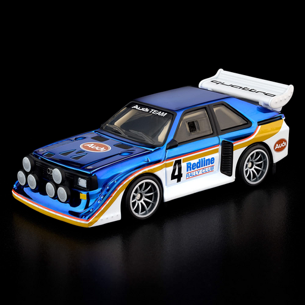
      </a>
      <a href="assets/showcase/audi-sport-quattro-s1.png">
        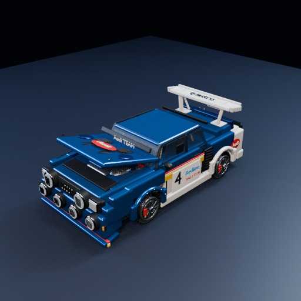
      </a><br>
      <sub>Reference → ProcAgen3D GLB</sub><br>
      <strong>Audi Sport Quattro S1</strong>
    </td>
    <td align="center" width="33%">
      <a href="assets/showcase/nissan-skyline-super-silhouette-reference.png">
        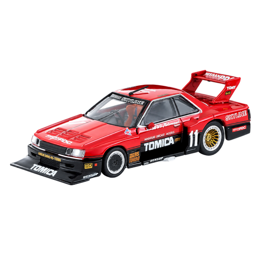
      </a>
      <a href="assets/showcase/nissan-skyline-super-silhouette.png">
        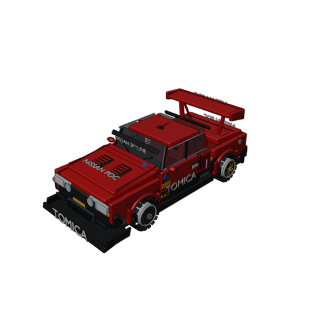
      </a><br>
      <sub>Reference → ProcAgen3D GLB</sub><br>
      <strong>Nissan Skyline Super Silhouette</strong>
    </td>
    <td align="center" width="33%">
      <a href="assets/showcase/pagani-huayra-r-reference.png">
        
      </a>
      <a href="assets/showcase/pagani-huayra-r.png">
        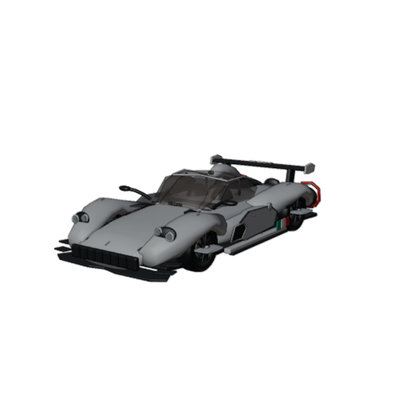
      </a><br>
      <sub>Reference → ProcAgen3D GLB</sub><br>
      <strong>Pagani Huayra R</strong>
    </td>
  </tr>
  <tr>
    <td align="center" width="33%">
      <a href="assets/showcase/toyota-sr5-reference.png">
        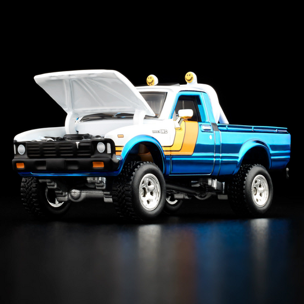
      </a>
      <a href="assets/showcase/toyota-sr5.png">
        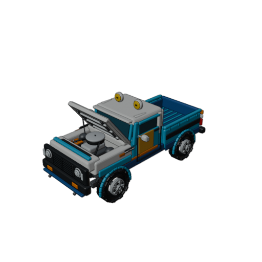
      </a><br>
      <sub>Reference → ProcAgen3D GLB</sub><br>
      <strong>Toyota SR5</strong>
    </td>
    <td align="center" width="33%">
      <a href="assets/showcase/city-bicycle-reference.png">
        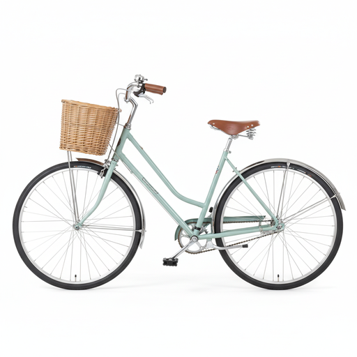
      </a>
      <a href="assets/showcase/city-bicycle.png">
        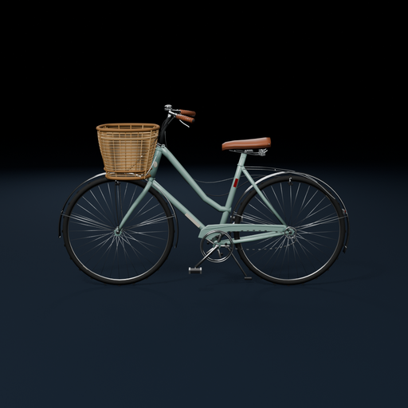
      </a><br>
      <sub>Reference → ProcAgen3D GLB</sub><br>
      <strong>City Bicycle</strong>
    </td>
    <td align="center" width="33%">
      <a href="assets/showcase/quadcopter-drone-reference.png">
        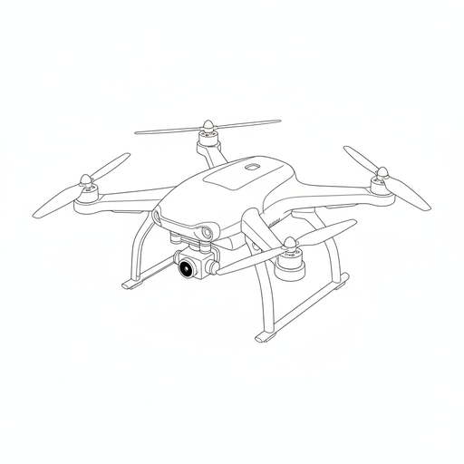
      </a>
      <a href="assets/showcase/quadcopter-drone.png">
        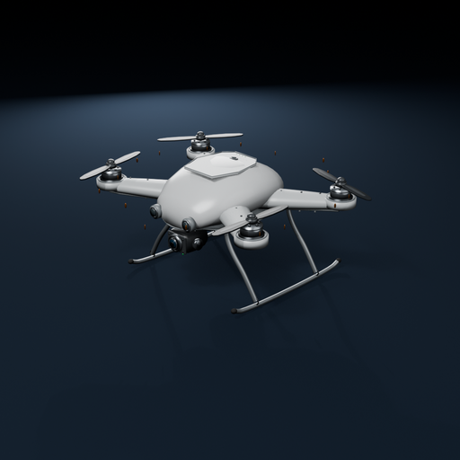
      </a><br>
      <sub>Reference → ProcAgen3D GLB</sub><br>
      <strong>Quadcopter Drone</strong>
    </td>
  </tr>
  <tr>
    <td align="center" width="33%">
      <a href="assets/showcase/china-pavilion-reference.png">
        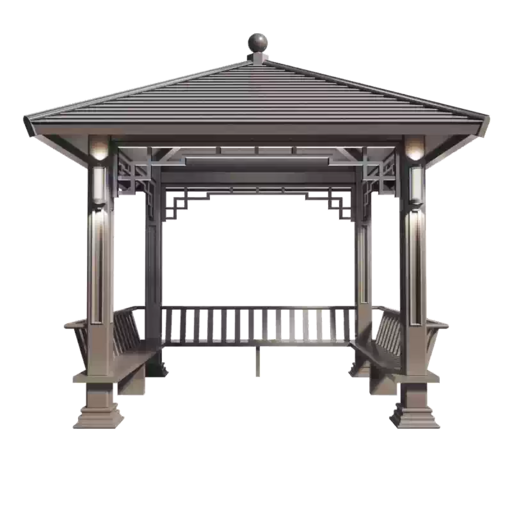
      </a>
      <a href="assets/showcase/china-pavilion.png">
        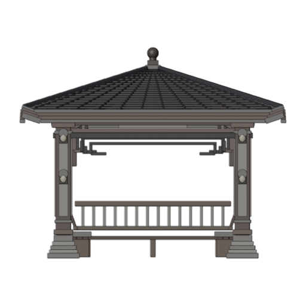
      </a><br>
      <sub>Reference → ProcAgen3D GLB</sub><br>
      <strong>Traditional Chinese Pavilion</strong>
    </td>
    <td align="center" width="33%">
      <a href="assets/showcase/spanish-colonial-townhouse-reference.png">
        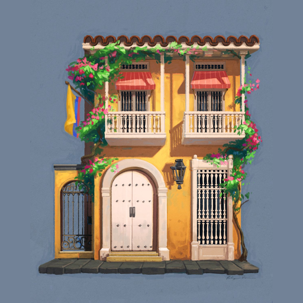
      </a>
      <a href="assets/showcase/spanish-colonial-townhouse.png">
        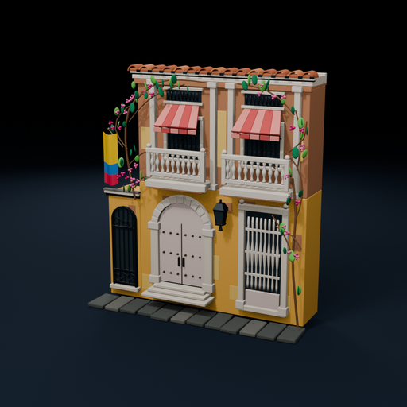
      </a><br>
      <sub>Reference → ProcAgen3D GLB</sub><br>
      <strong>Spanish Colonial Townhouse</strong>
    </td>
    <td align="center" width="33%">
      <a href="assets/showcase/cozy-living-room-reference.png">
        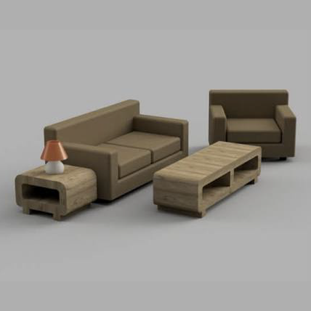
      </a>
      <a href="assets/showcase/cozy-living-room.png">
        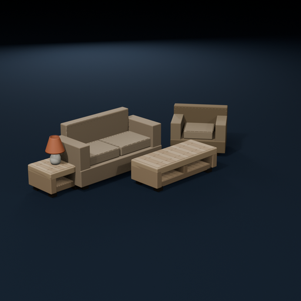
      </a><br>
      <sub>Reference → ProcAgen3D GLB</sub><br>
      <strong>Cozy Living Room</strong>
    </td>
  </tr>
  <tr>
    <td align="center" width="33%">
      <a href="assets/showcase/benben-robot-reference.png">
        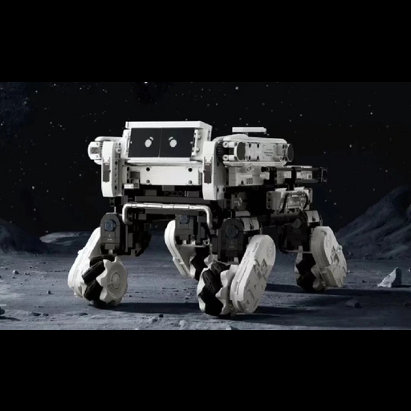
      </a>
      <a href="assets/showcase/benben-robot.png">
        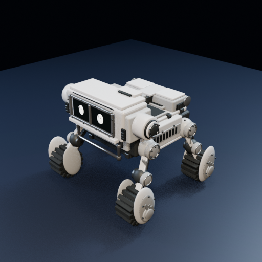
      </a><br>
      <sub>Reference → ProcAgen3D GLB</sub><br>
      <strong>Benben Robot</strong>
    </td>
    <td align="center" width="33%">
      <a href="assets/showcase/compact-carbine-reference.png">
        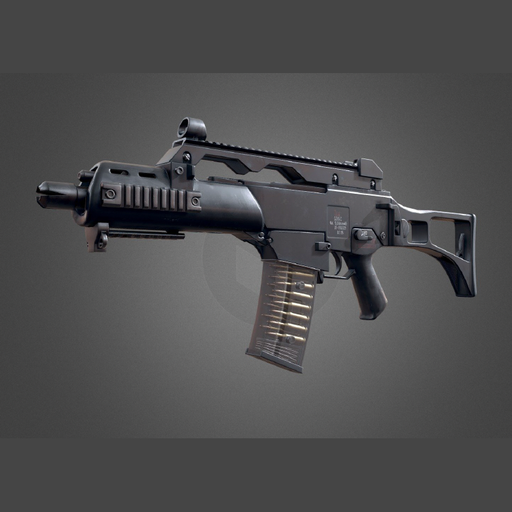
      </a>
      <a href="assets/showcase/compact-carbine.png">
        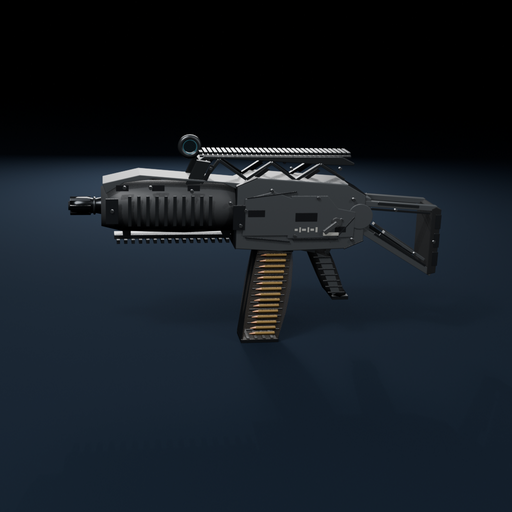
      </a><br>
      <sub>Reference → ProcAgen3D GLB</sub><br>
      <strong>Compact Carbine</strong>
    </td>
    <td align="center" width="33%">
      <a href="assets/showcase/fujifilm-x-t3-reference.png">
        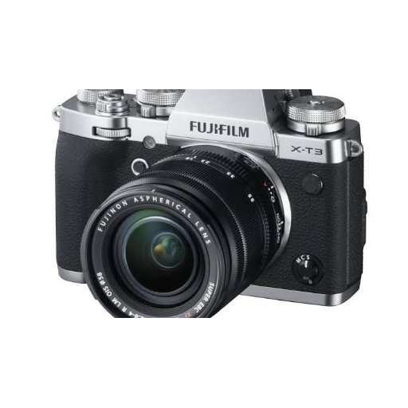
      </a>
      <a href="assets/showcase/fujifilm-x-t3.png">
        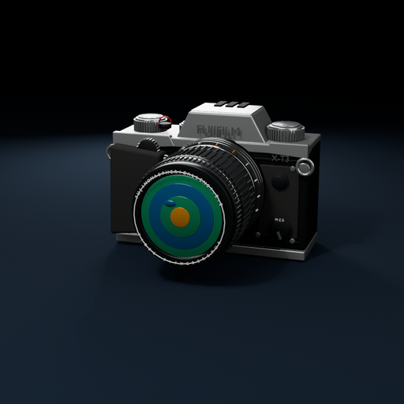
      </a><br>
      <sub>Reference → ProcAgen3D GLB</sub><br>
      <strong>Fujifilm X-T3</strong>
    </td>
  </tr>
</table>

## How it works

The agent supplies design judgment and visual review; a deterministic,
stdlib-only harness enforces the paper's pipeline around it:

```
reconstruction plan → reconstruction probe → camera solve (image-conditioned)
→ synthesize program → build + canonical renders (headless Blender)
→ registered local-silhouette + pose fit (image-conditioned) → deterministic checks
→ agent-vision inspection → guarded repair loop (complexity-scaled)
→ articulation validation → constraint scoring → deliver
```

Every stage is a CLI command with exit codes and grep-able
`[PROCAGEN3D:OK|WARN|FAIL]` tags, so nothing depends on the agent's honesty:
build errors, doctrine violations, broken joints, failed reference fits, and
failed dimensional constraints are all caught mechanically. Semantic
perception is agent vision by design — no learned depth/normal/edge models.
Registered camera, mask, landmark, pose-chain, ratio, and layout gates verify
visible projection; `CAMERA_SOLVE`, `SYMMETRY`, `DETACHED_PARTS`, `RIGID_AXIS`,
and `SCENE_INTERPENETRATION` catch 3D faults a single view cannot see. Fit
floors scale with the number of reference views, and a bounded single-view
shortfall may ship as approximate with `limitations.md`.

## Repository layout

```
procagen3d/
├── procagen3d-skill/     # the skill — see its README for full docs
│   ├── SKILL.md          # entry point: the staged loop and gates
│   ├── scripts/          # driver + Blender-side stages
│   ├── references/       # routed depth docs (doctrine, joints, edits, …)
│   └── examples/         # bench-style items: L1_stool, L2_bicycle, L3_robot_arm
└── assets/               # tracked teaser/showcase + gitignored test material
```

## Requirements

- **Blender 4.x or 5.x** (tested on 4.5 LTS and 5.2 LTS), found via
  `--blender` flag → `$PROCAGEN3D_BLENDER` → PATH →
  `~/.cache/procagen3d/*/blender`. On macOS, Blender 5.x headless needs
  Metal GPU access; a sandboxed launch SIGSEGVs during GPU detection.
- **Python 3.10+**. No pip packages — the harness is stdlib only, and
  Blender stages run under Blender's bundled Python.

## Update log

Entries are newest first.

### 0.4.0 — 2026-08-23

- Added the opt-in `organic-v1` character/humanoid route with an anatomy-first
  probe, deformation-layer decomposition, explicit major-joint transitions,
  facial-region planning, and optional armature enforcement.
- Added `character_plan.json`, root/plan subject-domain routing, and
  `check --subject character` gates for anatomy markers and chains, connected
  transition hosts, character mesh layers, facial coverage, and skinned rigs.
- Replaced object-style 260/420 independent-mesh pressure on characters with
  character-specific topology/triangle/material floors and a fragmentation
  diagnostic. Object and scene floors and region-density behavior are
  unchanged.
- Added a reusable character plan example and an eleven-test regression suite
  covering schema, connected character contracts, and preservation of generic
  thresholds.

### 0.3.0 — 2026-08-21

- Added `procagen3d solve-camera` to resect the registered viewpoint from
  image-read landmarks, lock it into `camera_solve`/`fit_spec`, and fail
  `CAMERA_SOLVE` when resection does not converge.
- Added 3D structural gates a single registered view cannot see: `SYMMETRY`
  for mirrored left/right pairs, `DETACHED_PARTS` for floating mesh islands,
  `RIGID_AXIS` for collinear long assemblies, and `SCENE_INTERPENETRATION`
  for declared multi-object instances.
- Made fit floors evidence-adaptive: IoU thresholds drop 0.08 on a single
  view, stay put at two, and rise 0.03 at three or more. Harness-owned
  `threshold_policy` and `landmark_provenance` integrity checks stay in force.
- Added bounded single-view approximate delivery via `limitations.md` (at
  most 25% of gates, IoU miss ≤ 0.08, error ≤ 2× ceiling). Multi-view failures
  still stop, and integrity faults never qualify.
- Scaled probe and repair budgets by complexity class, and documented Blender
  5.x / macOS Metal headless requirements.
- Added city bicycle, compact carbine, Fujifilm X-T3, cozy living room,
  quadcopter drone, and Spanish colonial townhouse showcase pairs; regrouped
  the grid by category; and re-rendered the pavilion and townhouse in the
  same studio-lit Eevee style as the other GLB stills.

### 0.2.0 — 2026-08-17

- Replaced mixed-form continuous-volume quotas with evidence-backed per-part
  shape families, preventing legitimate camera/rifle boxes and prisms from
  being rounded into lofts or ellipsoids.
- Added `reconstruction_plan.json` with candidate-tested shape priors,
  program-family tags, semantic feature coverage, and perceptual complexity.
- Added fit schema v2 with contour-informative local silhouette regions,
  directed frame-axis gates, and articulated pose-chain gates for segment
  direction, bend, and normalized link length.
- Added complexity-adaptive detail floors and hard showcase coverage checks so
  simple repeated objects do not set the budget for cars and mecha; complex
  plans must also distribute required features across occupied object regions.
- Generalized the shape-only stage into an image reconstruction probe that must
  pass family, camera, pose, and local-silhouette evidence before detail.

### 0.1.0 — 2026-08-11

- Added the versioned `fit_spec.json` contract for registered cameras, masks,
  landmarks, ratios, scene instances, and spatial relations.
- Added `procagen3d fit`, exact reference-resolution rendering, overlays,
  scored masks, and a machine-readable `fit_report.json`.
- Added deterministic fit gates and hash-based freshness checks. Image-based
  outputs now fail `check` when fit evidence is missing, failed, or stale;
  text-only outputs remain unaffected.
- Added explicit README release tracking and documented the registered-fit
  workflow throughout the skill.
- Reformatted the showcase as three columns per row with smaller image pairs.

### 0.0.1 — 2026-08-08

- Published the initial code-native Blender generation workflow with build,
  render, checks, articulation validation, constraint scoring, guarded repair,
  and local-edit gates.
